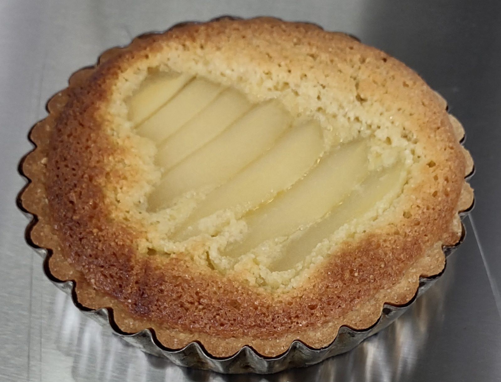

###Ingredients
1 quantity of [Sweet Tart Paste](/recipe/sweetTartPaste)  
100g butter  
100g sugar  
100g almond meal  
2 eggs  
2 or 3 poached pears

###Method
Set the oven to 180ºc fan or 190ºc normal oven  
Grease and flour an 16cm tart tin

1. Roll out the pastry to approximately 3mm, line the tart tin and place in the fridge until the almond cream is ready
2. Cream butter and sugar
3. Stir a couple of tablespoons of the almond meal
4. Stir in the egg
5. Add the almond meal and give it a good mix until its smooth
6. Spread the paste over your tart case
7. Top with sliced pears, leaving some of the almond paste uncovered
8. Bake for 20-30 minutes
