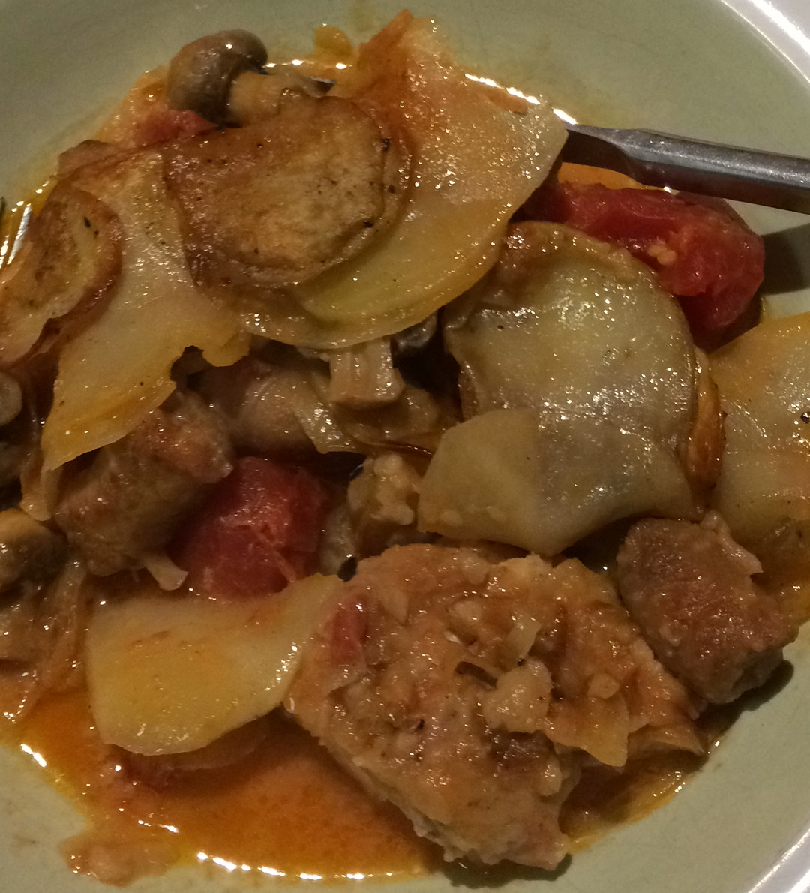

###Ingredients
4-6 chicken thighs (bone in or not)  
1 tin of crushed or chopped tomatoes  
1 tbsp chicken stock powder or a crumbled stock cube
150 mls cream
1 punnet of sliced mushrooms (if you like them)  
1 tin of white or cannelini beans  
4 large sliced potatoes  
1 large sliced onion (onion rings type slices)  
salt and black pepper to taste  

###Method
Set the oven to 180ºc  
1. Cut the onion in half then slice into half onion rings.  Set aside
2. Slice the potatoes (I get out the mandolin to do the onions and spuds - its way quick)
3. Put the sliced spuds in a plastic bag and tip in oil, salt and pepper and smush about so they are all covered
4. In a medium sized baking dish or a dutch oven, tip oil in and wipe around so the dish is greased on the bottom
5. __Layer up the ingredients:__  Cover the bottom of the dish with a layer of sliced onion, then potatoes, then mushrooms if using
6. Salt and pepper the chicken pieces, then layer over spuds and onions
7. Tip over a drained tin of beans 
8. Add layer of the remaining onion then potatoes, keeping some for the top (and mushrooms)
9. In a jug or something, mix the tin of tomatoes, cream, chicken stock and some salt and pepper and tip over the things
10. Add another layer of potatoes making sure they have enough oil for them to crisp up when cooking
11. Bake in a moderate oven for about 40 minutes until bubbly and the potatoes are crispy on the top.  Don't put the lid on if you using a dutch oven
12. Serve with salad or veggies.  Double it all for a massive baking dish to feed more.  So easy, one dish, proper yummy comfort food
