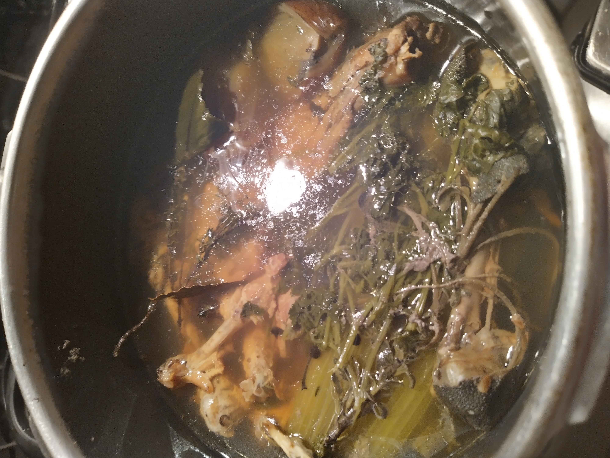

I use a pressure cooker for making stock; it only takes an hour once it is up to pressure.  Alternatively you can keep a slow rolling simmer in a large stock pot for 3-4 hours (although I'm not really qualified to say).  You can use bones of any animal - I follow the same process regardless of type of bones used.

##Ingredients
2 large carrots  
2 -3 large onions  
4-5 sticks of celery  
1 tbsp black peppercorns  
1 tbsp salt  
3 bay leaves  
2 sprigs of thyme  
1 leek  
1.5kg chicken bones
bunch of parsley (use roots if you are picking from your garden)

__Optional items:__  
Parmesan cheese rind (I throw these in the freezer once I finish the cheese block)  
1 punnet of mushrooms

###Method
1. Cut the dirty roots off the onions and cut in half - I leave the skins on
2. Cut the ends of the carrots - I don't bother peeling them
3. Put all the ingredients into your pressure cooker and fill up to 3 inches from the top
4. Bring the pot up to pressure and cook on medium pressure for 1 hour
5. Strain through a fine sieve and bottle while boiling to sterilise the bottles (I turn them upside down to also cook any residual germs in the jar/bottle lid)

