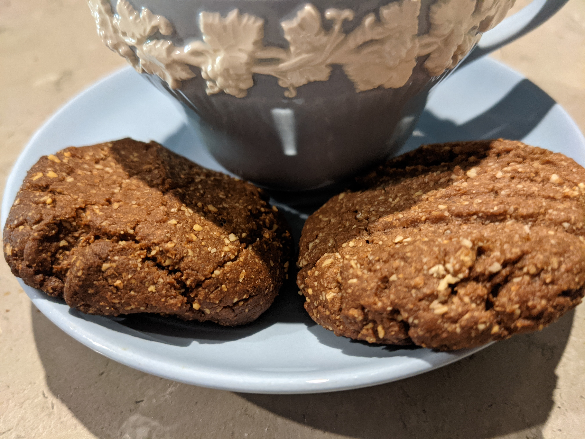

###Ingredients
1½ cups plain flour  
½ cup almond meal or tiger nut flour  
125g butter  
1 cup sugar  
2 tbsp peanut butter  
¼ cup cocoa  
2 tbsp golden syrup or treacle  
1 tsp bi carb soda  
1 egg

###Method

1. Set oven to moderate 180ºc
2. Mix dry ingredients in a large mixing bowl
3. Melt butter, peanut butter, golden syrup and water in saucepan. Simmer for 1 minute
4. Remove from heat and add soda, stirring so it floofts
5. Add the sugar and give it a good stir to combine and cool the mixture down
6. Once cool enough, add the egg and thoroughly mix so it goes thick and shiny
7. Stir in remaining dry ingredients. Note for a smooth biscuit, use almond meal, for a gritty, nutty texture, use tiger nut flour
8. Roll into balls and place on baking sheet. Press down on top with a fork
9. Bake for 15-20 minutes - less if you like them chewy; more if you like them crunchy
10. If you are feeling fancy, you can dunk one side of each biscuit in melted chocolate or join them with chocolate butter cream
