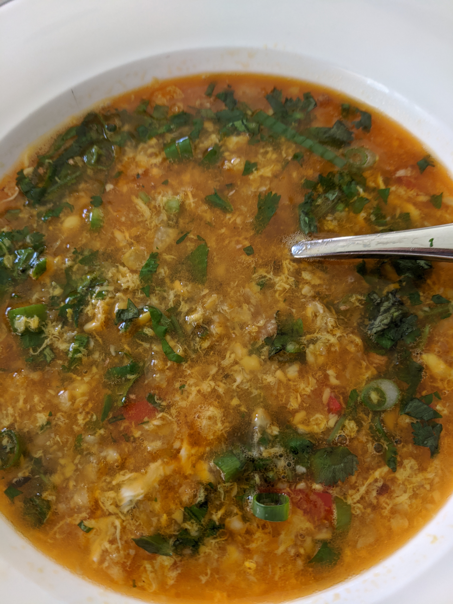

###Ingredients
1 litre chicken stock  
2 tsps grated ginger  
1 or two lighly beaten eggs  
1 tbsp crab paste with bean oil  
2 cloves garlic  
2 spring onions  
1 or 2 chopped red chili peppers  
1 bunch of coriander including roots  
1 tbsp coconut oil   
1 drained tin of corn or 2 grated corn cobs  
1 tbsp fish sauce  
1 tbsp soy sauce  

###Method
1. Heat heavy saucepan with coconut oil
2. Fry crab paste, garlic, ginger, chili, white part of chopped spring onions and finely chopped coriander root and stems in oil until starting to brown and aromatic
3. While that is cooking, put the stick blender in the drained corn tin; you can add some chicken stock to make it easier.  Blend enough to make chunky but still lumpy.  Alternatively grate your corn cobs
4. Add the corn to the pan and cook for a couple of minutes, stirring through the other garlic etc
5. Add the chicken stock to the corn mixture and bring to the boil
6. Lighly beat the egg with the soy and fish sauce
7. Once the soup is simmering, stir and add the beaten egg whilst stirring to make eggy ribbons
8. Garnish with chopped coriander leaves, the green parts of the spring onion and some fresh chopped chili   
9. Add some more fish or soy sauce to taste if you need, and a squeeze of lime juice at the end too if you have some
