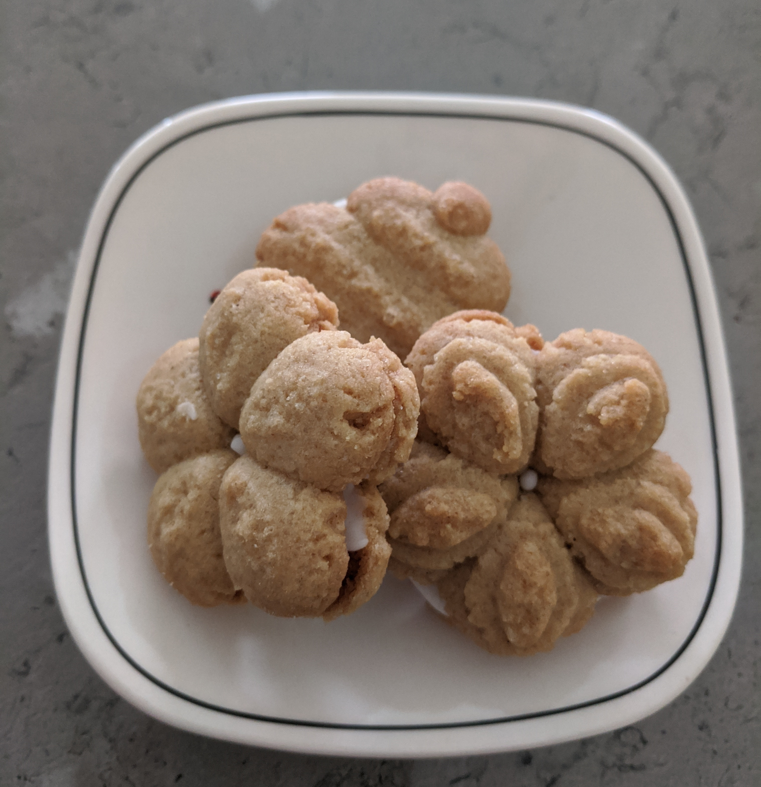

**NOTE**: This is an old family recipe, so the cup measures used are an old English style afternoon tea cup (rather than an Aus 250ml measuring cup)
###Ingredients
½lb butter  
2½ cups flour  
1 cup sugar  
2 tsp ginger powder  
1 egg  
1 tbsp golden syrup  
1 tsp bi carb soda

###Method

1. Grease biscuit trays or cover with baking paper
2. Cream butter and sugar with electric mixer
3. Add egg and syrup and beat until combined
4. Add sifted dry ingredients and beat until it comes together into a lump of bikky dough
5. Use a biscuit forcer or roll into balls and press down with a fork or the back of a wet teaspoon
6. Bake for 12-15 minutes
7. These can be joined together with lemon or vanilla icing/butter cream
