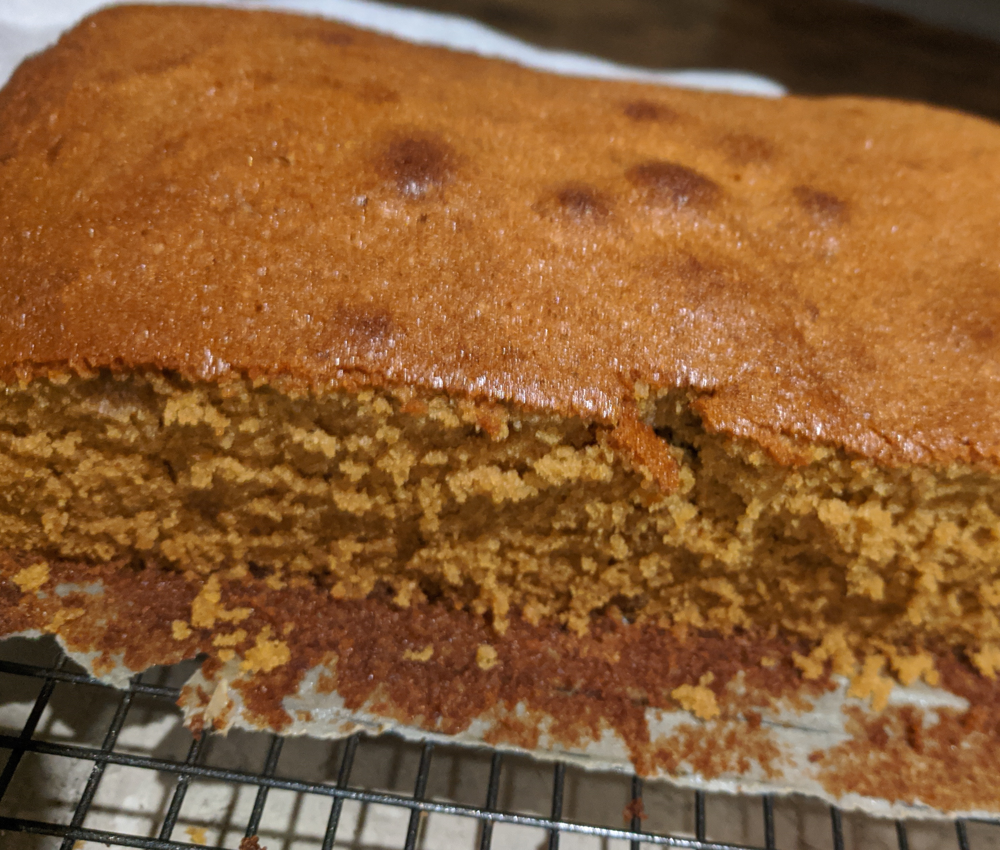

###Ingredients
½ cup butter  
1 cup sugar  
3 eggs  
1 cup milk  
½ cup treacle (or golden syrup but treacle is better)  
1 tbsp ginger  
½ tsp bi carb soda  
2 cups flour  
1 tbsp boiling water

###Method

1. Set oven to 180ºc
2. Grease and line lamington tin
3. Boil the kettle and dissolve the soda in hot water
4. Cream butter and sugar with electric mixer
5. Beat in eggs, one at a time
6. Add milk then sifted ginger and flour alternately, mixing after each addition until all combined
7. Add treacle and soda
8. Pour into prepared tin and bake for approximately 1 hour or until knife comes out clean
