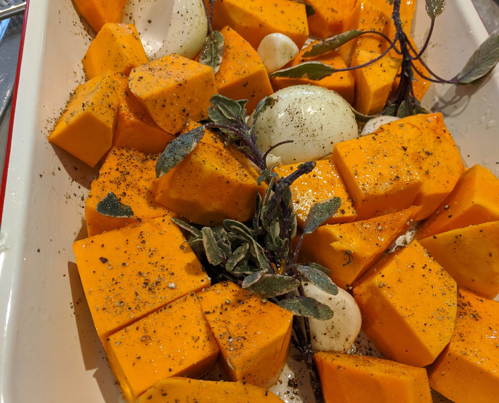

###Ingredients
Half a medium sized pumpkin, chopped into roast size pieces  
Handfull of sage leaves  
4 cloves of garlic  
Salt and pepper  
2 chopped potatoes or a chunk of sweet potato  
1 red onion chopped into quarters  
1 brown onion  
1 litre of chicken stock  
Olive oil  
__For a garnish__
2 middle bacon rashers  
½ tsp chilli flakes  
Good dollop of sour cream
###Method

1. Set oven at 180ºc
2. Place pumpkin, whole garlic cloves, sage and quartered red onions onto oven tray or roasting dish and cover with salt, pepper and olive oil.
3. Roast until pumpkin is soft and cooked through; approximately 40 minutes. (Hack: Cut pumpkin pieces smaller if you are short of time or impatient)
4. While pumpkin is cooking, chop onion and a few additional sage leaves and fry in large soup pot with more olive oil, salt and pepper.  Cook through until onion is transparent
5. Add peeled and chopped potato and stir, cooking for 5 minutes
6. Add chicken stock and bring up to simmer
7. Once pumpkin is cooked, add to soup pot and simmer until spuds are soft
8. Deglaze the roasting pan to get all the good caramelised umami flavour and tip into your soup pot
9. Once all the veggies are cooked, blend in blender or whizz with a stick blender until smooth

__For the garnish__ 

10. Chop bacon rashers into small squares and fry with chilli flakes until crispy.
11. When serving, add a dollop of sour cream and the crispy bacon pieces.  
