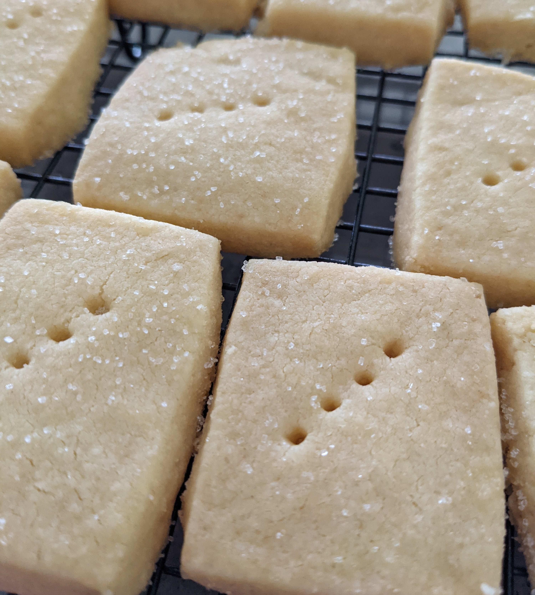

###Ingredients
8 oz cold chopped butter  
4 oz sugar  
12 oz flour  
2 oz rice or corn flour  
###Method

1. Set oven to 130ºc
2. Mix all ingredients using the flat beater/dough hook style attachment until come together and form a dough. Don't over work the dough
3. Roll out to 1cm thickness and cut into whatever shape you would like your shortbreads
4. Stab the centre part way through each biscuit with a fork and sprinkle with sugar
5. Bake in slow oven for approximately 15 minutes; dont really need to brown these
6. Cool on cake rack and store in airtight container once completely cooled
