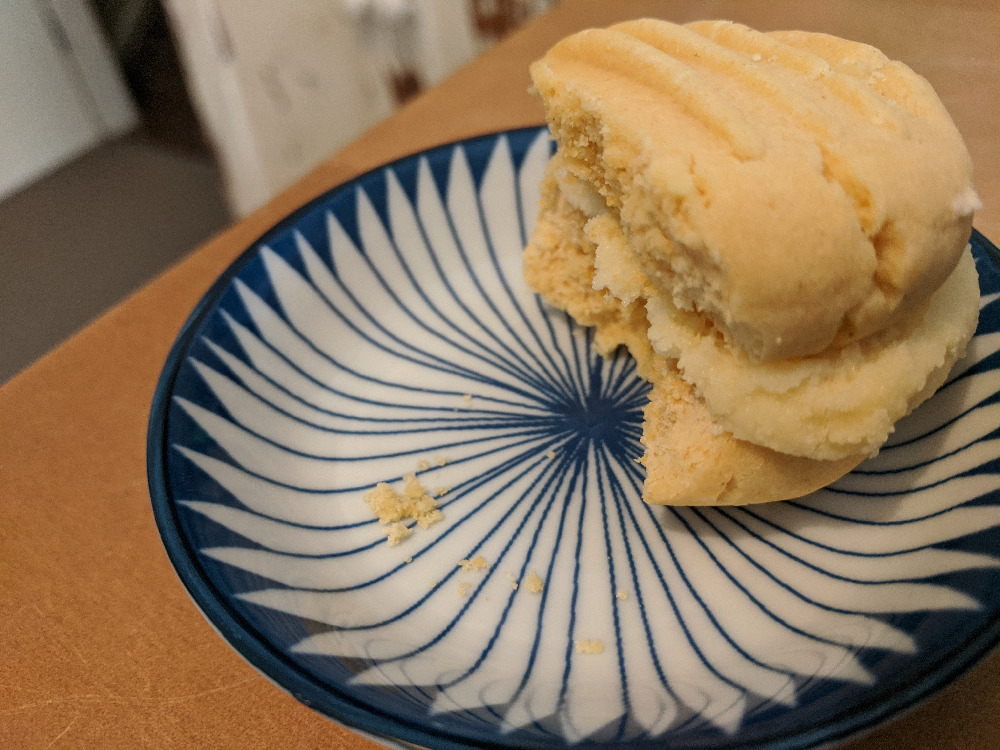

Might have eaten the other half

###Ingredients
6 oz cold chopped butter  
2 oz sugar  
8 oz SR flour  
2 oz custard powder  
1 tbsp milk  
###Method

1. Set oven to 160ºc
2. Grease or line biscuit trays with baking paper
3. Mix all ingredients using the flat beater/dough hook style attachment until come together and form a dough
4. Roll large teaspoons of mix into a ball and press down with a fork on the top
5. Bake in slow oven for approximately 15 minutes; dont really need to brown these
6. Join with icing once they are completely cooled
7. **For the icing**: With electric beater, mix 110g icing sugar with 80g softened butter until light and fluffy (pure icing sugar will set harder/better than icing mixture)
